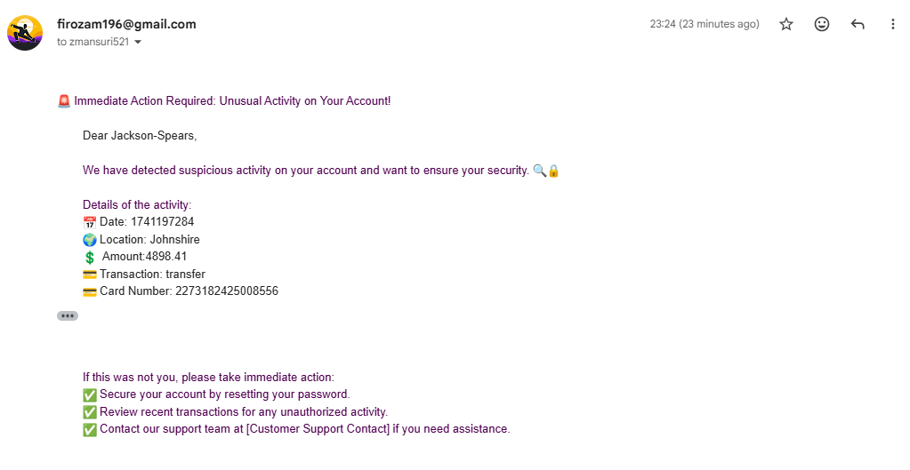

# Fraud Detection System with Apache Kafka

# 📌 Overview

This project is a real-time fraud detection system using Apache Kafka. The system processes streaming transaction data and identifies fraudulent activities using rule-based detection mechanisms.

# 🏗️ Architecture

Kafka Producer: Simulates or ingests transaction data from various sources.

Kafka Broker: Manages and distributes transaction messages.

Kafka Consumer (Fraud Detector): Analyzes transactions and detects potential fraud.

Alert System: Sends Emails for potential fraud cases.

---

# 🚀 Features

Real-time transaction streaming using Kafka.

Rule-based and machine-learning fraud detection.

Scalable and distributed architecture.

Alerting mechanism for suspicious transactions.

---

# 🛠️ Technologies Used

Apache Kafka: Real-time message streaming.

Python: Backend processing.

Kafka Streams: Real-time transaction analysis.

MongoDB: Storage for transaction history and fraud logs.

---

# 📊 Data Flow

Transactions are generated or ingested.

Kafka Producer publishes transaction messages.

Kafka Broker distributes messages.

Fraud Detector Consumer processes the data.

Alerts are triggered if fraud is detected.

